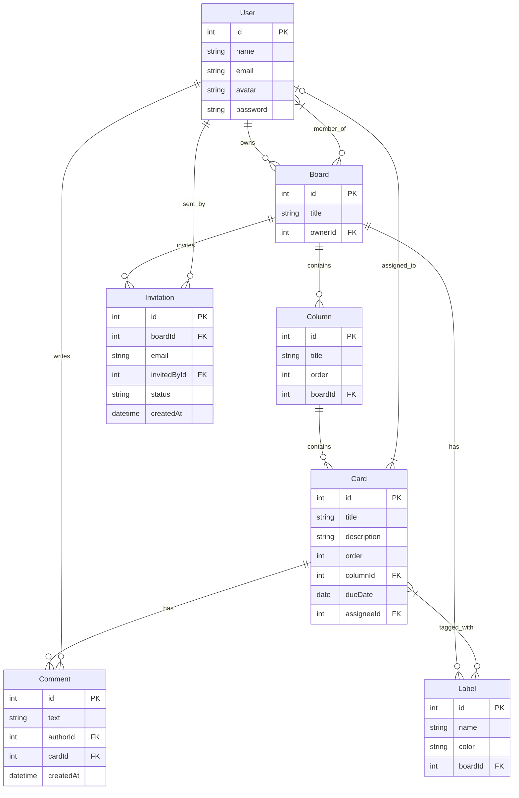

# ProTask — Product Requirements Document

## 1. Présentation

ProTask est un gestionnaire de tâches Kanban léger, inspiré de Trello/Notion. L'utilisateur peut créer des boards, organiser des tâches dans des colonnes personnalisables, assigner des membres, et suivre l'avancement.

## 2. Pages

| Page | Description |
|------|-------------|
| Login / Register | Authentification utilisateur |
| Dashboard | Liste des boards sous forme de grille |
| Board | Kanban avec colonnes, cartes, sidebar membres |
| Board Settings | Configuration du board (colonnes, labels, membres) |
| Profil | Avatar, nom, email |

## 3. Modèle de données

- **User** — id, name, email, avatar, password
- **Board** — id, title, owner (userId), members (User[])
- **Column** — id, title, order, boardId
- **Card** — id, title, description, order, columnId, labels (Label[]), dueDate, assignee (User), comments (Comment[])
- **Label** — id, name, color, boardId
- **Comment** — id, text, author (userId), cardId, createdAt
- **Invitation** — id, boardId, email, invitedBy (userId), status (pending | accepted), createdAt

## 4. Tables détaillées

### User

| Champ | Type | Contrainte | Description |
|-------|------|------------|-------------|
| id | INT | PK, AUTO_INCREMENT | Identifiant unique |
| name | VARCHAR(100) | NOT NULL | Nom complet de l'utilisateur |
| email | VARCHAR(255) | NOT NULL, UNIQUE | Adresse email de connexion |
| avatar | VARCHAR(500) | NULLABLE | URL de l'avatar |
| password | VARCHAR(255) | NOT NULL | Mot de passe hashé (bcrypt) |
| createdAt | DATETIME | NOT NULL, DEFAULT NOW() | Date de création |

### Board

| Champ | Type | Contrainte | Description |
|-------|------|------------|-------------|
| id | INT | PK, AUTO_INCREMENT | Identifiant unique |
| title | VARCHAR(255) | NOT NULL | Titre du board |
| ownerId | INT | NOT NULL, FK → User.id | Propriétaire du board |
| createdAt | DATETIME | NOT NULL, DEFAULT NOW() | Date de création |

### Column

| Champ | Type | Contrainte | Description |
|-------|------|------------|-------------|
| id | INT | PK, AUTO_INCREMENT | Identifiant unique |
| title | VARCHAR(100) | NOT NULL | Titre de la colonne |
| order | INT | NOT NULL | Ordre d'affichage |
| boardId | INT | NOT NULL, FK → Board.id | Board parent |
| createdAt | DATETIME | NOT NULL, DEFAULT NOW() | Date de création |

### Card

| Champ | Type | Contrainte | Description |
|-------|------|------------|-------------|
| id | INT | PK, AUTO_INCREMENT | Identifiant unique |
| title | VARCHAR(255) | NOT NULL | Titre de la carte |
| description | TEXT | NULLABLE | Description détaillée |
| order | INT | NOT NULL | Ordre dans la colonne |
| columnId | INT | NOT NULL, FK → Column.id | Colonne parente |
| dueDate | DATE | NULLABLE | Date d'échéance |
| assigneeId | INT | NULLABLE, FK → User.id | Membre assigné |
| createdAt | DATETIME | NOT NULL, DEFAULT NOW() | Date de création |
| updatedAt | DATETIME | NOT NULL, DEFAULT NOW() ON UPDATE NOW() | Dernière modification |

### Label

| Champ | Type | Contrainte | Description |
|-------|------|------------|-------------|
| id | INT | PK, AUTO_INCREMENT | Identifiant unique |
| name | VARCHAR(50) | NOT NULL | Nom du label |
| color | VARCHAR(7) | NOT NULL | Couleur hexadécimale (ex: #FF0000) |
| boardId | INT | NOT NULL, FK → Board.id | Board parent |
| createdAt | DATETIME | NOT NULL, DEFAULT NOW() | Date de création |

### Comment

| Champ | Type | Contrainte | Description |
|-------|------|------------|-------------|
| id | INT | PK, AUTO_INCREMENT | Identifiant unique |
| text | TEXT | NOT NULL | Contenu du commentaire |
| authorId | INT | NOT NULL, FK → User.id | Auteur du commentaire |
| cardId | INT | NOT NULL, FK → Card.id | Carte associée |
| createdAt | DATETIME | NOT NULL, DEFAULT NOW() | Date de création |

### Invitation

| Champ | Type | Contrainte | Description |
|-------|------|------------|-------------|
| id | INT | PK, AUTO_INCREMENT | Identifiant unique |
| boardId | INT | NOT NULL, FK → Board.id | Board concerné |
| email | VARCHAR(255) | NOT NULL | Email du destinataire |
| invitedById | INT | NOT NULL, FK → User.id | Utilisateur ayant invité |
| status | ENUM('pending','accepted') | NOT NULL, DEFAULT 'pending' | Statut de l'invitation |
| createdAt | DATETIME | NOT NULL, DEFAULT NOW() | Date de création |

## 5. Fonctionnalités

- Créer / supprimer un board
- Créer / éditer / déplacer / supprimer des colonnes
- Créer / éditer / déplacer / supprimer des cartes
- Drag & drop des cartes entre colonnes et au sein d'une colonne
- Étiquettes / labels par board
- Dates d'échéance sur les cartes
- Assignation d'un membre à une carte
- Commentaires sur les cartes
- Invitation de membres par email
- Authentification (login / register)

## 6. Layout global

- **Top bar** : logo ProTask à gauche, avatar + logout à droite
- **Dashboard** : header "Mes boards" + grille de cartes
- **Board** : top bar + sidebar (membres, bouton inviter) + colonnes Kanban (scroll horizontal)
- **Board Settings / Profil** : top bar + formulaire centré

## 7. Design System

- **Palette** : fond #F9FAFB, accent #4F46E5 (indigo), texte #111827
- **Cartes board** : fond blanc, border-radius 8px, ombre légère
- **Colonnes Kanban** : fond #F3F4F6, border-radius 8px, largeur 280px
- **Cartes Kanban** : fond blanc, border-radius 6px, ombre subtile
- **Modales** : overlay semi-transparent #00000050, centré, fond blanc, border-radius 12px
- **Typo** : Inter / system-ui, sans-serif

## 8. Interactions clés

- Drag & drop natif (HTML5 Drag & Drop API ou lib externe)
- Modale overlay pour détails/édition de carte
- Création rapide d'une carte en bas de colonne
- Sidebar du board : liste des membres avec avatars

## 9. API Routes

### Authentification

| Méthode | Route | Auth | Description | Corps requête | Réponse |
|---------|-------|------|-------------|---------------|---------|
| POST | /api/auth/register | Non | Inscription | { name, email, password } | { user, token } |
| POST | /api/auth/login | Non | Connexion | { email, password } | { user, token } |

### Users

| Méthode | Route | Auth | Description | Corps requête | Réponse |
|---------|-------|------|-------------|---------------|---------|
| GET | /api/users/me | Oui | Profil connecté | — | { user } |
| PUT | /api/users/me | Oui | Modifier profil | { name?, avatar? } | { user } |

### Boards

| Méthode | Route | Auth | Description | Corps requête | Réponse |
|---------|-------|------|-------------|---------------|---------|
| GET | /api/boards | Oui | Liste des boards | — | { boards[] } |
| POST | /api/boards | Oui | Créer un board | { title } | { board } |
| GET | /api/boards/:id | Oui | Détail du board | — | { board, columns[], labels[], members[] } |
| PUT | /api/boards/:id | Oui | Modifier le board | { title? } | { board } |
| DELETE | /api/boards/:id | Oui | Supprimer le board | — | — |

### Columns

| Méthode | Route | Auth | Description | Corps requête | Réponse |
|---------|-------|------|-------------|---------------|---------|
| POST | /api/boards/:boardId/columns | Oui | Créer une colonne | { title } | { column } |
| PUT | /api/columns/:id | Oui | Modifier la colonne | { title?, order? } | { column } |
| DELETE | /api/columns/:id | Oui | Supprimer la colonne | — | — |

### Cards

| Méthode | Route | Auth | Description | Corps requête | Réponse |
|---------|-------|------|-------------|---------------|---------|
| POST | /api/columns/:columnId/cards | Oui | Créer une carte | { title } | { card } |
| GET | /api/cards/:id | Oui | Détail de la carte | — | { card, labels[], comments[] } |
| PUT | /api/cards/:id | Oui | Modifier la carte | { title?, description?, order?, columnId?, dueDate?, assigneeId? } | { card } |
| DELETE | /api/cards/:id | Oui | Supprimer la carte | — | — |

### Labels

| Méthode | Route | Auth | Description | Corps requête | Réponse |
|---------|-------|------|-------------|---------------|---------|
| POST | /api/boards/:boardId/labels | Oui | Créer un label | { name, color } | { label } |
| GET | /api/boards/:boardId/labels | Oui | Liste des labels du board | — | { labels[] } |
| PUT | /api/labels/:id | Oui | Modifier le label | { name?, color? } | { label } |
| DELETE | /api/labels/:id | Oui | Supprimer le label | — | — |
| POST | /api/cards/:cardId/labels | Oui | Associer un label | { labelId } | { card } |
| DELETE | /api/cards/:cardId/labels/:labelId | Oui | Dissocier un label | — | { card } |

### Comments

| Méthode | Route | Auth | Description | Corps requête | Réponse |
|---------|-------|------|-------------|---------------|---------|
| POST | /api/cards/:cardId/comments | Oui | Ajouter un commentaire | { text } | { comment } |
| PUT | /api/comments/:id | Oui | Modifier le commentaire | { text } | { comment } |
| DELETE | /api/comments/:id | Oui | Supprimer le commentaire | — | — |

### Invitations

| Méthode | Route | Auth | Description | Corps requête | Réponse |
|---------|-------|------|-------------|---------------|---------|
| POST | /api/boards/:boardId/invitations | Oui | Inviter un membre | { email } | { invitation } |
| GET | /api/invitations | Oui | Invitations reçues | — | { invitations[] } |
| PUT | /api/invitations/:id | Oui | Répondre à l'invitation | { status: 'accepted'\|'declined' } | { invitation } |
