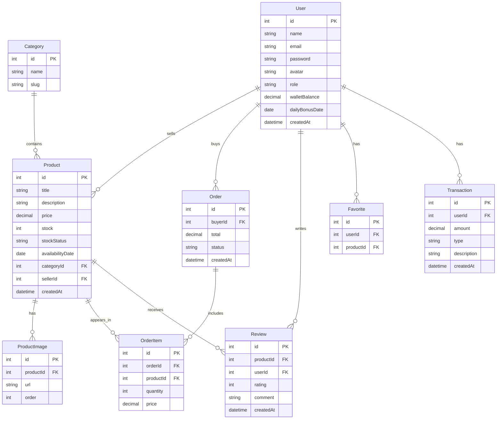

# ShopFlow — Product Requirements Document

## 1. Présentation

ShopFlow est une marketplace e-commerce où chaque utilisateur peut être acheteur et vendeur. Le système intègre une monnaie virtuelle avec bonus quotidiens, missions, et wallet.

## 2. Pages

| Page | Accès | Description |
|------|-------|-------------|
| Accueil | Public | Hero banner, catégories, produits populaires |
| Catalogue | Public | Grille produits + filtres (catégorie, prix, note) |
| Produit | Public | Image, description, avis, ajout panier |
| Panier | Connecté | Récapitulatif, modification quantité |
| Checkout | Connecté | Adresse, résumé commande, validation |
| Profil Acheteur | Connecté | Mes commandes, favoris, wallet |
| Dashboard Vendeur | Connecté | Stats, ajouter/éditer produits, ventes |
| Wallet | Connecté | Solde, historique, bonus quotidien |
| Login / Register | Public | Authentification |
| Admin | Admin | Utilisateurs, catégories, créditer |

## 3. Modèle de données

## 4. Tables détaillées

### User

| Champ | Type | Contrainte | Description |
|-------|------|-----------|-------------|
| id | INT | PK, AUTO_INCREMENT | Identifiant unique |
| name | VARCHAR(100) | NOT NULL | Nom complet |
| email | VARCHAR(255) | NOT NULL, UNIQUE | Email de connexion |
| password | VARCHAR(255) | NOT NULL | Mot de passe hashé |
| avatar | VARCHAR(500) | NULLABLE | URL avatar |
| role | ENUM('super_admin','admin','user') | NOT NULL, DEFAULT 'user' | Rôle utilisateur |
| walletBalance | DECIMAL(10,2) | NOT NULL, DEFAULT 10000 | Solde du portefeuille virtuel |
| dailyBonusDate | DATE | NULLABLE | Date du dernier bonus quotidien |
| createdAt | DATETIME | NOT NULL, DEFAULT NOW() | Date création |

### Category

| Champ | Type | Contrainte | Description |
|-------|------|-----------|-------------|
| id | INT | PK, AUTO_INCREMENT | Identifiant unique |
| name | VARCHAR(100) | NOT NULL | Nom de la catégorie |
| slug | VARCHAR(100) | NOT NULL, UNIQUE | Slug URL |

### Product

| Champ | Type | Contrainte | Description |
|-------|------|-----------|-------------|
| id | INT | PK, AUTO_INCREMENT | Identifiant unique |
| title | VARCHAR(200) | NOT NULL | Titre du produit |
| description | TEXT | NOT NULL | Description détaillée |
| price | DECIMAL(10,2) | NOT NULL | Prix unitaire |
| stock | INT | NOT NULL, DEFAULT 0 | Quantité en stock |
| stockStatus | ENUM('in_stock','low_stock','out_of_stock','pre_order') | NOT NULL, DEFAULT 'in_stock' | Statut du stock |
| availabilityDate | DATE | NULLABLE | Date de disponibilité (rupture/précommande) |
| categoryId | INT | FK → Category.id | Catégorie associée |
| sellerId | INT | FK → User.id | Vendeur propriétaire |
| createdAt | DATETIME | NOT NULL, DEFAULT NOW() | Date création |

### ProductImage

| Champ | Type | Contrainte | Description |
|-------|------|-----------|-------------|
| id | INT | PK, AUTO_INCREMENT | Identifiant unique |
| productId | INT | FK → Product.id | Produit associé |
| url | VARCHAR(500) | NOT NULL | URL de l'image |
| order | INT | NOT NULL, DEFAULT 0 | Ordre d'affichage |

### Order

| Champ | Type | Contrainte | Description |
|-------|------|-----------|-------------|
| id | INT | PK, AUTO_INCREMENT | Identifiant unique |
| buyerId | INT | FK → User.id | Acheteur |
| total | DECIMAL(10,2) | NOT NULL | Montant total |
| status | ENUM('pending','confirmed','shipped','delivered','cancelled') | NOT NULL, DEFAULT 'pending' | Statut commande |
| createdAt | DATETIME | NOT NULL, DEFAULT NOW() | Date création |

### OrderItem

| Champ | Type | Contrainte | Description |
|-------|------|-----------|-------------|
| id | INT | PK, AUTO_INCREMENT | Identifiant unique |
| orderId | INT | FK → Order.id | Commande associée |
| productId | INT | FK → Product.id | Produit commandé |
| quantity | INT | NOT NULL, DEFAULT 1 | Quantité |
| price | DECIMAL(10,2) | NOT NULL | Prix unitaire au moment de l'achat |

### Review

| Champ | Type | Contrainte | Description |
|-------|------|-----------|-------------|
| id | INT | PK, AUTO_INCREMENT | Identifiant unique |
| productId | INT | FK → Product.id | Produit concerné |
| userId | INT | FK → User.id | Auteur de l'avis |
| rating | TINYINT | NOT NULL, CHECK(1-5) | Note (1 à 5) |
| comment | TEXT | NULLABLE | Commentaire |
| createdAt | DATETIME | NOT NULL, DEFAULT NOW() | Date création |

### Favorite

| Champ | Type | Contrainte | Description |
|-------|------|-----------|-------------|
| id | INT | PK, AUTO_INCREMENT | Identifiant unique |
| userId | INT | FK → User.id | Utilisateur |
| productId | INT | FK → Product.id | Produit favori |

### Transaction

| Champ | Type | Contrainte | Description |
|-------|------|-----------|-------------|
| id | INT | PK, AUTO_INCREMENT | Identifiant unique |
| userId | INT | FK → User.id | Utilisateur concerné |
| amount | DECIMAL(10,2) | NOT NULL | Montant (positif = crédit, négatif = débit) |
| type | VARCHAR(50) | NOT NULL | Type (achat, vente, bonus, admin) |
| description | VARCHAR(255) | NULLABLE | Description de la transaction |
| createdAt | DATETIME | NOT NULL, DEFAULT NOW() | Date création |

## 5. Fonctionnalités

- Catalogue avec recherche et filtres (catégorie, prix, note, disponibilité)
- Page produit avec images, avis, notation, statut stock
- Gestion de stock : in_stock, low_stock, out_of_stock, pre_order
- Date de disponibilité pour les ruptures de stock et précommandes
- Badge "Rupture de stock" / "Précommande" / "Stock épuisé" sur les cartes produit
- Filtre catalogue par disponibilité
- Alertes stock faible pour les vendeurs (dashboard)
- Panier : impossibilité d'ajouter si stock = 0
- Checkout : validation des stocks avant confirmation
- Panier d'achat (CRUD quantités)
- Checkout avec adresse de livraison
- Wallet avec solde virtuel
- Bonus quotidien (+500 crédits/jour)
- Missions pour gagner des crédits
- Dashboard vendeur (gérer produits, stock, voir ventes, revenus)
- Rôles : super_admin, admin, user
- Admin : gérer utilisateurs, catégories, créditer
- Favoris
- Commandes et historique

## 6. Layout global

- **Top bar** : logo ShopFlow, search bar, icônes panier/wallet/profil, login/register
- **Accueil** : hero banner + grille catégories + produits populaires
- **Catalogue** : sidebar filtres (gauche) + grille produits (droite)
- **Checkout** : formulaire adresse (gauche) + résumé commande (droite)
- **Dashboard Vendeur** : sidebar navigation + contenu principal
- **Admin** : sidebar navigation + contenu principal

## 7. Design System

6 templates distincts (même logique, visuels différents) :
1. **Glassmorphism** — fond dégradé, cartes floutées
2. **Neo-Brutalist** — bordures épaisses, couleurs vives
3. **Clean Minimal** — blanc/indigo, aéré
4. **Bento UI** — pastel, grille asymétrique
5. **Dark Corporate** — anthracite, data-dense
6. **Shadcn Docs** — border-based, dark/light toggle, sidebar docs

## 8. Système de monnaie virtuelle

- Solde initial : 10 000 crédits
- Vente : le vendeur reçoit le prix du produit
- Achat : l'acheteur paie depuis son wallet
- Bonus quotidien : +500 crédits (1x par jour)
- Admin : peut créditer/débiter n'importe quel compte

## 9. API Routes

### Authentification

| Méthode | Route | Auth | Description | Corps requête | Réponse |
|---------|-------|------|-------------|---------------|---------|
| POST | /api/auth/register | Non | Inscription | { name, email, password } | { user, token } |
| POST | /api/auth/login | Non | Connexion | { email, password } | { user, token } |
| GET | /api/auth/me | Oui | Profil connecté | — | { user } |

### Produits

| Méthode | Route | Auth | Description | Corps requête | Réponse |
|---------|-------|------|-------------|---------------|---------|
| GET | /api/products | Non | Liste produits (filtres, pagination) | Query: ?categoryId=&minPrice=&maxPrice=&stockStatus=&search=&page=&limit= | { products[], total, page } |
| GET | /api/products/:id | Non | Détail produit | — | { product, images[], seller, reviews[] } |
| POST | /api/products | Vendeur | Créer produit | { title, description, price, stock, stockStatus, availabilityDate, categoryId, images[] } | { product } |
| PUT | /api/products/:id | Vendeur | Modifier produit | { title?, description?, price?, stock?, ... } | { product } |
| DELETE | /api/products/:id | Vendeur | Supprimer produit | — | { message } |

### Catégories

| Méthode | Route | Auth | Description | Corps requête | Réponse |
|---------|-------|------|-------------|---------------|---------|
| GET | /api/categories | Non | Liste catégories | — | { categories[] } |
| POST | /api/categories | Admin | Créer catégorie | { name, slug } | { category } |
| PUT | /api/categories/:id | Admin | Modifier catégorie | { name?, slug? } | { category } |
| DELETE | /api/categories/:id | Admin | Supprimer catégorie | — | { message } |

### Panier

| Méthode | Route | Auth | Description | Corps requête | Réponse |
|---------|-------|------|-------------|---------------|---------|
| GET | /api/cart | Oui | Voir panier | — | { items[], total } |
| POST | /api/cart | Oui | Ajouter au panier | { productId, quantity } | { item } |
| PUT | /api/cart/:itemId | Oui | Modifier quantité | { quantity } | { item } |
| DELETE | /api/cart/:itemId | Oui | Retirer du panier | — | { message } |

### Commandes

| Méthode | Route | Auth | Description | Corps requête | Réponse |
|---------|-------|------|-------------|---------------|---------|
| GET | /api/orders | Oui | Mes commandes | — | { orders[] } |
| GET | /api/orders/:id | Oui | Détail commande | — | { order, items[] } |
| POST | /api/orders | Oui | Passer commande (checkout) | { address, cartItems[] } | { order } |
| PUT | /api/orders/:id/cancel | Oui | Annuler commande | — | { order } |

### Avis

| Méthode | Route | Auth | Description | Corps requête | Réponse |
|---------|-------|------|-------------|---------------|---------|
| GET | /api/products/:productId/reviews | Non | Avis d'un produit | Query: ?page=&limit= | { reviews[], averageRating, total } |
| POST | /api/products/:productId/reviews | Oui | Publier un avis | { rating, comment } | { review } |
| DELETE | /api/reviews/:id | Oui | Supprimer mon avis | — | { message } |

### Favoris

| Méthode | Route | Auth | Description | Corps requête | Réponse |
|---------|-------|------|-------------|---------------|---------|
| GET | /api/favorites | Oui | Mes favoris | — | { favorites[] } |
| POST | /api/favorites | Oui | Ajouter favori | { productId } | { favorite } |
| DELETE | /api/favorites/:productId | Oui | Retirer favori | — | { message } |

### Wallet

| Méthode | Route | Auth | Description | Corps requête | Réponse |
|---------|-------|------|-------------|---------------|---------|
| GET | /api/wallet | Oui | Solde et historique | Query: ?page=&limit= | { balance, transactions[] } |
| POST | /api/wallet/daily-bonus | Oui | Réclamer bonus quotidien | — | { bonus, newBalance } |

### Admin

| Méthode | Route | Auth | Description | Corps requête | Réponse |
|---------|-------|------|-------------|---------------|---------|
| GET | /api/admin/users | Admin | Lister utilisateurs | Query: ?page=&limit=&role= | { users[], total } |
| PUT | /api/admin/users/:id/role | Admin | Changer rôle | { role } | { user } |
| POST | /api/admin/users/:id/credit | Admin | Créditer/débiter wallet | { amount, description } | { user, transaction } |
| GET | /api/admin/categories | Admin | Lister catégories | — | { categories[] } |
| POST | /api/admin/categories | Admin | Créer catégorie | { name, slug } | { category } |
| PUT | /api/admin/categories/:id | Admin | Modifier catégorie | { name?, slug? } | { category } |
| DELETE | /api/admin/categories/:id | Admin | Supprimer catégorie | — | { message } |
