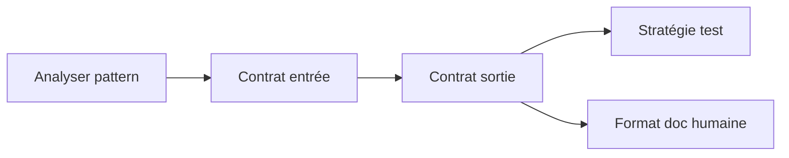

# Wayfinder Map: Guide pédagogique + Skill write-guide-docs

## Destination

Un skill réutilisable `write-guide-docs` + une documentation humaine (guide pédagogique) qui ensemble permettent de générer un guide d'apprentissage complet (leçons, checkpoints, quizzes, tests, manifest) pour n'importe quel projet+framework, en suivant le pattern learning-path prouvé sur ProTask+AdonisJS.

Le skill est l'exécutable ; la doc est la référence lisible.

## Notes

- Skill doit suivre les conventions `writing-skills` (TDD, RED-GREEN-REFACTOR)
- Skill générique : prend un nom de projet + nom de framework, produit tout le guide
- Le skill doit inclure ses propres tests (self-testing)
- Répertoire des skills : `/home/warol52/.agents/skills/`
- La doc humaine et le skill sont complémentaires — le skill est la connaissance exécutable, la doc est la référence

## Decisions so far

<!-- the index — one line per closed ticket -->

## Tickets

<!--
Tickets are files in wayfinder/guide-pedagogique/tickets/NN-title.md
One file per ticket, with ## Question body.
-->

| # | Titre | Type | Status | Bloqué par |
|---|-------|------|--------|------------|
| 1 | **Analyser le pattern learning-path existant** | Research | ✅ Résolu | — |
| 2 | **Définir le contrat d'entrée du skill** | Grilling | ✅ Résolu | #1 |
| 3 | **Définir le contrat de sortie du skill** | Grilling | ✅ Résolu | #2 |
| 4 | **Définir la stratégie de test du skill** | Grilling | ✅ Résolu | #3 |
| 5 | **Rechercher la structure projet et API** | Research | ✅ Résolu | — |
| 6 | **Définir le format du guide pédagogique humain** | Grilling | ✅ Résolu | #3 |

### Dépendances

### Frontière actuelle

Tous les tickets sont résolus. La route est claire — prochaine phase : implémenter le skill et la doc.

## Not yet specified

- Comment le skill gère-t-il les mises à jour d'un guide existant (overwrite, merge, diff) ?
- Relation exacte entre le skill et la doc humaine — la doc est-elle dérivée du skill ou indépendante ?
- Faut-il un système de templates (lesson template, quiz template, test template) ou tout est inline dans le skill ?
- Comment le skill valide-t-il que le projet cible existe bien et a les fichiers attendus (PRD, OpenAPI, API server) ?

## Out of scope

- Construire des guides pour des projets spécifiques (c'est ce que le skill permet, pas l'objet de cette map)
- Modifier le viewer / le player de learning-path
- Modifier l'API server ou le tester.js
